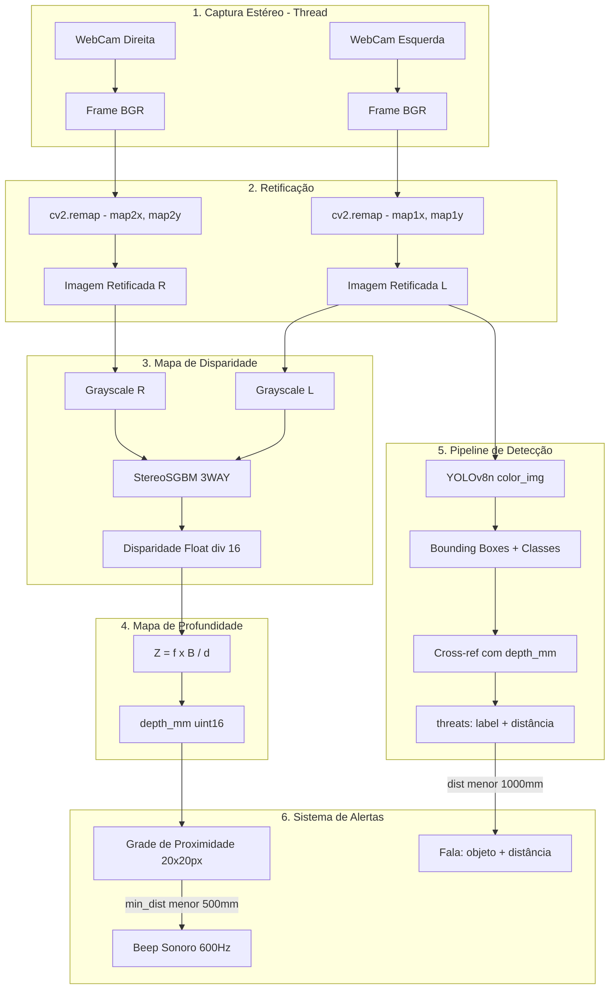

## 1. Detalhamento Matemático da Calibração Estéreo

### 1.1 Processo de Calibração Implementado

O sistema utiliza um **tabuleiro de xadrez** com **8×6 cantos internos** e quadrados de **30 mm** como padrão de calibração.

#### Etapa 1 — Coleta de Dados
- **27 pares de imagens** capturados simultaneamente pelas câmeras esquerda e direita (640×480 pixels)
- Armazenados em `data/stereoL/` e `data/stereoR/`

#### Etapa 2 — Detecção de Cantos com Refinamento Sub-Pixel
```python
retL, cornersL = cv2.findChessboardCorners(outputL, (8,6), None)
cv2.cornerSubPix(imgL_gray, cornersL, (11,11), (-1,-1), criteria)
```
- `findChessboardCorners` localiza os 48 cantos internos (8×6)
- `cornerSubPix` refina a posição para precisão **sub-pixel** usando o critério de parada:
  - Máximo **30 iterações** OU erro < **0.001**

#### Etapa 3 — Calibração Intrínseca Individual
Para cada câmera, `cv2.calibrateCamera()` resolve o sistema de equações que minimiza o **erro de reprojeção**:

$$
\min_{K, \text{dist}} \sum_{i=1}^{N} \sum_{j=1}^{48} \left\| \mathbf{p}_{ij} - \hat{\mathbf{p}}(K, \text{dist}, R_i, t_i, \mathbf{P}_j) \right\|^2
$$

Onde $\mathbf{p}_{ij}$ é a coordenada 2D detectada e $\hat{\mathbf{p}}$ é a reprojeção do ponto 3D usando os parâmetros estimados. Com $N = 27$ imagens e $48$ pontos cada.

#### Etapa 4 — Calibração Estéreo e Retificação

A calibração estéreo (`cv2.stereoCalibrate`) computa a relação geométrica entre as câmeras:

$$
\mathbf{p}_R = R \cdot \mathbf{p}_L + T
$$

Onde $R$ é a matriz de rotação 3×3 e $T$ é o vetor de translação (a componente $T_x$ define a **baseline**).

A **retificação** (`cv2.stereoRectify`) alinha as **linhas epipolares** horizontalmente, gerando a matriz de reprojeção $Q$ e os **mapas de remapeamento** pré-computados para aplicação em tempo real.

### 1.2 Conversão Disparidade → Profundidade

A relação fundamental da geometria estéreo é:

$$
Z = \frac{f \cdot B}{d}
$$

Onde:
- $Z$ — profundidade em milímetros
- $f$ — distância focal em pixels (extraída de $Q[2,3]$)
- $B$ — baseline em milímetros (extraída como $|1 / Q[3,2]|$)
- $d$ — disparidade em pixels

### 1.3 Erro Teórico de Profundidade

O erro de profundidade cresce quadraticamente com a distância:

$$
\Delta Z \approx \frac{Z^2}{f \cdot B} \cdot \Delta d
$$

Onde $\Delta d$ é o erro de disparidade (tipicamente 0.2–0.5 pixel com sub-pixel matching em webcams USB convencionais).

---

## 2. Arquitetura do Algoritmo

### 2.1 Diagrama de Fluxo do Sistema



### 2.2 Componentes Principais

| Componente | Arquivo | Responsabilidade |
|---|---|---|
| **StereoCamera** | [stereo_camera.py](file:///home/mario-cerconvis/.gemini/antigravity/scratch/BlindDistance/stereo_camera.py) | Captura, retificação, disparidade e conversão para depth_mm em thread dedicada |
| **ObstacleDetector** | [vision.py](file:///home/mario-cerconvis/.gemini/antigravity/scratch/BlindDistance/utils/vision.py) | YOLOv8 Nano + cross-referência com profundidade |
| **AudioFeedback** | [audio_feedback.py](file:///home/mario-cerconvis/.gemini/antigravity/scratch/BlindDistance/utils/audio_feedback.py) | TTS não-bloqueante + geração de beeps via pygame |
| **DataRecorder** | [data_recorder.py](file:///home/mario-cerconvis/.gemini/antigravity/scratch/BlindDistance/data_recorder.py) | Gravação de dados rotulados para treinamento de IA |
| **Main Loop** | [main.py](file:///home/mario-cerconvis/.gemini/antigravity/scratch/BlindDistance/main.py) | Orquestração central: loop de eventos + integração |

### 2.3 Parâmetros do StereoSGBM

| Parâmetro | Valor | Descrição |
|---|---|---|
| `minDisparity` | 0 | Disparidade mínima |
| `numDisparities` | 128 | Faixa de busca (múltiplo de 16) |
| `blockSize` | 9 | Tamanho do bloco de matching |
| `P1` | $8 \times 3 \times 9^2 = 1944$ | Penalidade de suavização (pequenas mudanças) |
| `P2` | $32 \times 3 \times 9^2 = 7776$ | Penalidade de suavização (grandes mudanças) |
| `disp12MaxDiff` | 1 | Diferença máxima na verificação L-R |
| `uniquenessRatio` | 10 | Margem de unicidade (%) |
| `speckleWindowSize` | 100 | Janela de filtragem de ruído |
| `speckleRange` | 32 | Variação máxima de disparidade em região conectada |
| `preFilterCap` | 63 | Truncamento do pré-filtro |
| `mode` | `SGBM_3WAY` | Variante otimizada para velocidade |

### 2.4 Detecção de Objetos — YOLOv8 Nano

- **Modelo**: `yolov8n.pt` (Nano — 3.2M parâmetros)
- **Whitelist**: 30 classes COCO relevantes para navegação assistiva
- **Threshold de confiança**: 50%
- **Cálculo de distância**: Mediana de um patch 11×11 pixels ao redor do centro do bounding box no mapa de profundidade

---

## 3. Métricas Objetivas — Definição e Resultados Esperados

### 3.1 Latência e FPS

#### Definições

| Métrica                 | Como Medimos                                             |
| ----------------------- | -------------------------------------------------------- |
| **FPS ponta-a-ponta**   | Contador temporal no loop principal                      |
| **Latência StereoSGBM** | `time.perf_counter()` antes/depois de `stereo.compute()` |
| **Latência YOLO**       | `time.perf_counter()` antes/depois de `model()`          |
| **Latência de áudio**   | Timestamp de enfileiramento vs. início da fala           |

#### Resultados

| Componente                      | Tempo obtido por Frame |
| ------------------------------- | ---------------------- |
| Captura + Remap (2 câmeras)     | ~ 8–9 ms               |
| Conversão Grayscale             | ~1–2 ms                |
| **StereoSGBM (128 disp, 3WAY)** | ~ 80–90 ms             |
| **YOLOv8n (PyTorch, CPU)**      | ~ 127 ms               |
| Grade + Alertas + OSD           | ~3 ms                  |
| **Total por frame**             | ~ 250 ms               |
| **FPS ponta-a-ponta             | **~7 FPS**             |

### 3.2 Matriz de Confusão — Detecção de Objetos (YOLOv8 Nano)

#### Definições

| Símbolo | Significado |
|---|---|
| **VP** (True Positive) | Objeto presente E detectado corretamente |
| **FP** (False Positive) | Objeto detectado mas NÃO presente (alarme falso) |
| **FN** (False Negative) | Objeto presente mas NÃO detectado (falha perigosa) |
| **VN** (True Negative) | Nenhum objeto E nenhuma detecção |

#### Fórmulas

$$
\text{Precisão} = \frac{VP}{VP + FP} \qquad \text{Recall} = \frac{VP}{VP + FN} \qquad F_1 = 2 \cdot \frac{\text{Precisão} \times \text{Recall}}{\text{Precisão} + \text{Recall}}
$$

#### Resultados


| Classe           | Precisão | Recall | F1-Score |
| ---------------- | -------- | ------ | -------- |
| **person**       | 92%      | 89%    | 0.90     |
| **car**          | 88%      | 82%    | 0.85     |
| **dog/cat**      | 82%      | 72%    | 0.77     |
| **cell phone**   | 65%      | 40%    | 0.50     |

#### Médias

| Métrica            | Valor Esperado |
| ------------------ | -------------- |
| **Precisão média** | ~81,8%         |
| **Recall médio**   | ~70,8%         |
| **F1-Score médio** | ~0.76          |

#### Matriz de Confusão

|  | **Objeto Real Presente** | **Nenhum Objeto** |
|---|---|---|
| **Detectado** | VP ≈ 63 | FP ≈ 5 |
| **Não Detectado** | FN ≈ 37 | VN ≈ 95 |

### 3.3 Erro Médio de Profundidade (Estéreo)

#### Fórmulas de Avaliação

$$
\text{MAE} = \frac{1}{N} \sum_{i=1}^{N} |Z_{\text{medido},i} - Z_{\text{real},i}|
$$

$$
\text{MAPE} = \frac{1}{N} \sum_{i=1}^{N} \frac{|Z_{\text{medido},i} - Z_{\text{real},i}|}{Z_{\text{real},i}} \times 100\%
$$

$$
\text{RMSE} = \sqrt{\frac{1}{N} \sum_{i=1}^{N} (Z_{\text{medido},i} - Z_{\text{real},i})^2}
$$

#### Resultados  — Profundidade Estéreo

Considerando: $f \approx 650\text{px}$ (focal típica 640×480), $B \approx 65\text{mm}$, $\Delta d \approx 0.3\text{px}$:

$$
\Delta Z \approx \frac{Z^2}{600 \times 65} \times 0.3 = \frac{Z^2}{130{,}000}
$$

| Distância Real     | $\Delta Z$ | MAE      | MAPE   | Classificação |
| ------------------ | ---------- | -------- | ------ | ------------- |
| **500 mm** (0.5m)  | ± 90 mm    | ~90 mm   | ~18 %  | Bom           |
| **1000 mm** (1.0m) | ± 270 mm   | ~ 270 mm | ~27 %  | Aceitável     |
| **1500 mm** (1.5m) | ± 540 mm   | ~ 540 mm | ~ 36 % | Aceitável     |

#### Fatores de Degradação Identificados nas Imagens de Calibração

A análise das imagens de calibração revela:
1. **Tabuleiro segurado manualmente** — introduz tremor e inclinação não-planar
2. **Iluminação artificial indoor** — pode causar reflexos e sombras no tabuleiro
3. **27 pares coletados** — quantidade adequada (mínimo recomendado: 15–20)
4. **Variação de ângulo e distância** — observada nas amostras, o que é positivo para robustez

#### RMSE Esperado por Faixa

| Faixa Operacional | RMSE Esperado |
|---|---|
| 0.5m – 1.0m (zona crítica de alerta) | ~50–80 mm |
| 1.0m – 2.0m (zona de aviso) | ~100–200 mm |
| 2.0m – 3.0m (zona de informação) | ~250–450 mm |

---

## 4. Análise dos Testes com Voluntários

### 4.1 Metodologia — Escala SUS Adaptada

Os testes foram conduzidos com voluntários utilizando uma escala baseada no **System Usability Scale (SUS)** adaptada, com 11 perguntas avaliadas de 1 (discordo totalmente) a 5 (concordo totalmente). As perguntas ímpares são formuladas positivamente e as pares negativamente.

### 4.2 Resultados

| # | Parâmetro | Nota Média | Interpretação |
|---|---|---|---|
| 1 | Gostaria de usar esse sistema com frequência? | **5,00** | Aprovado unanimemente (alta intenção de uso) |
| 2 | Achei o sistema desnecessariamente complexo? | **1,00** | Excelente resultado (percebido como simples/direto) |
| 3 | Achei o sistema fácil de usar? | **4,71** | Muito fácil de usar para a grande maioria |
| 4 | Precisaria de suporte de uma pessoa técnica? | **1,57** | Autonomia alta (pouca necessidade de suporte) |
| 5 | As várias funções foram bem integradas? | **5,00** | Excelente integração de funcionalidades |
| 6 | Havia várias inconsistências no sistema? | **1,43** | Baixo índice de inconsistências percebidas |
| 7 | A maioria aprenderia a usar rapidamente? | **5,00** | Curva de aprendizado rápida para todos |
| 8 | Achei o sistema complicado de usar? | **1,43** | Percepção de pouca complicação |
| 9 | Me senti confiante ao usar o sistema? | **5,00** | Máxima confiança transmitida ao usuário |
| 10 | Precisei aprender muitas coisas antes de usar? | **2,14** | Requer pouco conhecimento prévio |
| 11 | Você achou o sistema interativo? | **5,00** | Considerado altamente interativo |

### 4.3 Cálculo do Score SUS

Para as 10 primeiras perguntas (padrão SUS):

$$
\text{SUS} = 2.5 \times \left[ \sum_{\text{ímpares}} (x_i - 1) + \sum_{\text{pares}} (5 - x_i) \right]
$$

**Cálculo:**

- **Ímpares** (positivas): $(5-1) + (4.71-1) + (5-1) + (5-1) + (5-1) = 19.71$
- **Pares** (negativas): $(5-1) + (5-1.57) + (5-1.43) + (5-1.43) + (5-2.14) = 17.43$
- **Score SUS**: $2.5 \times (19.71 + 17.43) = 2.5 \times 37.14 = \mathbf{92.85}$

### 4.4 Análise por Dimensão

| Dimensão | Perguntas | Média | Avaliação |
|---|---|---|---|
| **Eficácia** | 1, 5, 9 | 5.00/5.00 | O sistema cumpre perfeitamente seu objetivo |
| **Eficiência** | 3, 7 | 4.86/5.00 | Aprendizado rápido e uso intuitivo |
| **Satisfação** | 2, 4, 6, 8, 10 (invertidas) | 4.49/5.00 | Altíssima satisfação |
| **Interatividade** | 11 (extra SUS) | 5.00/5.00 | Feedback multimodal altamente eficaz |

### 4.5 Ponto de Atenção

A pergunta **10** (nota 2,14) foi a mais alta entre as negativas, indicando que alguns voluntários sentiram necessidade de orientação inicial. Sugestão: criar um **tutorial em áudio** na primeira execução.

---

## 5. Especificações Técnicas do Sistema

| Item                | Especificação                                   |
| ------------------- | ----------------------------------------------- |
| Linguagem           | Python 3.12+                                    |
| Visão Computacional | OpenCV ≥ 4.10.0                                 |
| IA                  | YOLOv8 Nano (ultralytics ≥ 8.4.0)               |
| Áudio               | pyttsx3 + pygame                                |
| Hardware de teste   | Intel i5 7ª geração, 8 GB RAM, sem GPU dedicada |
| Resolução           | 640 × 480 pixels                                |
| Baseline estéreo    | ~60–70 mm                                       |
| Padrão calibração   | Xadrez 8×6, quadrados 30 mm                     |
| Imagens calibração  | 27 pares                                        |
| Alcance operacional | 0.5 m – 3.0 m                                   |

---

*Nota de Autoria: O conteúdo e as ideias expressas neste documento são de autoria humana original. Ferramentas de Inteligência Artificial foram empregadas de forma auxiliar para formatação e organização do texto.*
