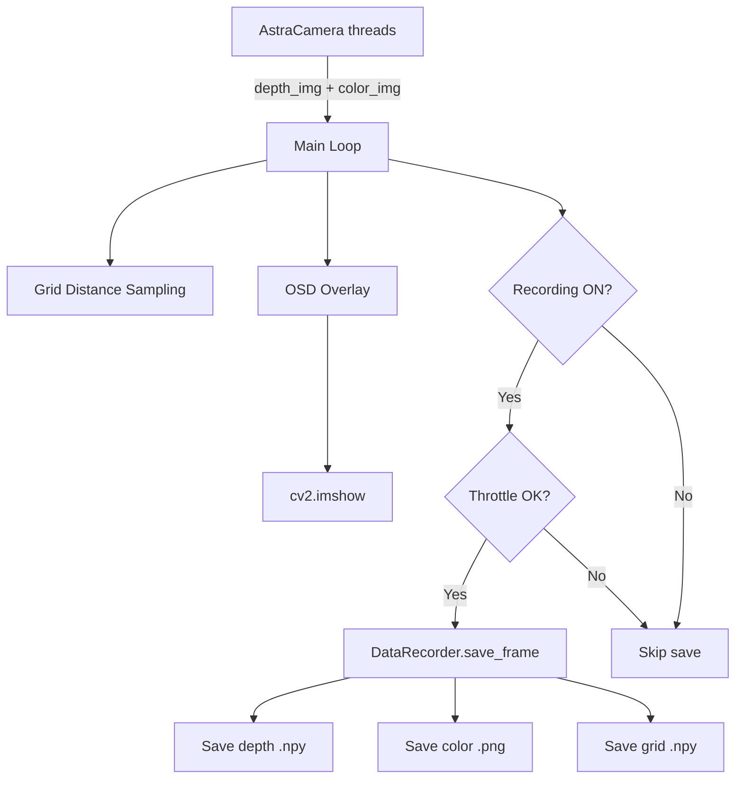

# BlindDistance — AI Training Data Recording Plan

## Goal
Add continuous data recording to the BlindDistance camera system, saving paired depth maps, color images, and grid distances organized by label categories for AI training.

## Data Saved Per Frame

| Data | Format | Size (approx) | Description |
|------|--------|----------------|-------------|
| Full depth map | `.npy` (uint16) | ~600KB | 480×640 raw depth in mm |
| Color image | `.png` (BGR) | ~300-500KB | 480×640×3 color frame |
| Grid distances | `.npy` (uint16) | ~1.4KB | 704 sampled grid point distances |

## Label Categories

| Key | Label | Description |
|-----|-------|-------------|
| `1` | `clear` | No obstacles in path |
| `2` | `person` | Person detected in scene |
| `3` | `wall` | Wall or large flat surface |
| `4` | `furniture` | Furniture obstacle |
| `5` | `other_obstacle` | Any other obstacle type |

## Directory Structure

```
dataset/
├── clear/
│   ├── depth/
│   │   ├── 00000001.npy
│   │   └── ...
│   ├── color/
│   │   ├── 00000001.png
│   │   └── ...
│   └── grid/
│       ├── 00000001.npy
│       └── ...
├── person/
│   ├── depth/
│   ├── color/
│   └── grid/
├── wall/
│   ├── depth/
│   ├── color/
│   └── grid/
├── furniture/
│   ├── depth/
│   ├── color/
│   └── grid/
└── other_obstacle/
    ├── depth/
    ├── color/
    └── grid/
```

Each label folder auto-numbers files starting from the highest existing number + 1, so recording sessions can be resumed without overwriting data.

## Controls

| Key | Action |
|-----|--------|
| `1-5` | Select label category |
| `r` | Toggle recording ON/OFF |
| `q` | Quit application |

## On-Screen Display (OSD)

The color image window will show:
- **Top-left**: Current label name, e.g., `[LABEL: clear]`
- **Top-right**: Recording status — `● REC` in red when recording, `■ PAUSED` in gray when not
- **Bottom-left**: Frame count for current label, e.g., `Saved: 142 frames`

## Rate Limiting

Recording at full camera FPS (~30fps) produces excessive data. The recorder will:
- Default to **2 frames per second** (configurable via `SAVE_FPS` constant)
- Use a simple time-based throttle — only save when elapsed time since last save ≥ `1/SAVE_FPS`

## Architecture



## New File: `data_recorder.py`

Responsibilities:
- Create and manage the `dataset/` directory structure
- Track per-label frame counters, auto-incrementing from existing files
- Provide `save_frame` method accepting `depth_img`, `color_img`, `grid_distances`, and `label`
- Handle rate limiting via timestamp comparison
- Expose `frame_count` property for OSD display

Key class: `DataRecorder`

```python
class DataRecorder:
    LABELS = ['clear', 'person', 'wall', 'furniture', 'other_obstacle']
    
    def __init__: 
        # base_dir, save_fps
        # creates directory structure
        # scans existing files for counters
    
    def save_frame:
        # depth_img, color_img, grid_distances, label
        # rate-limits and saves all three
    
    def get_frame_count:
        # returns count for given label
```

## Changes to `main.py`

1. **Import** `DataRecorder` from `data_recorder.py`
2. **Add state variables**: `current_label`, `recording`, `recorder` instance
3. **Key handling**: Expand `cv2.waitKey` to handle keys `1-5` for labels and `r` for record toggle
4. **Save call**: After grid sampling, if recording is on, call `recorder.save_frame`
5. **OSD drawing**: Add `cv2.putText` calls before `cv2.imshow` for label/status overlay

## Implementation Steps

1. Create `data_recorder.py` with the `DataRecorder` class
2. Modify `main.py` to add label cycling, recording toggle, OSD, and integration with `DataRecorder`
3. Test the full pipeline end-to-end
